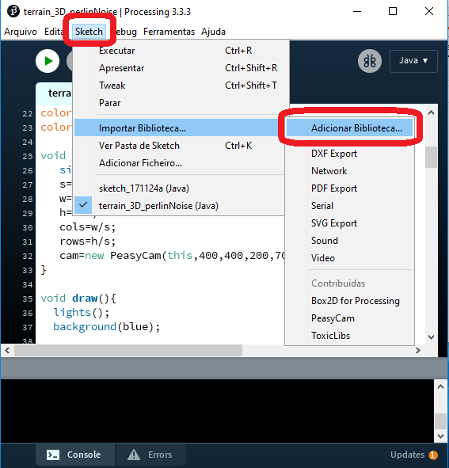
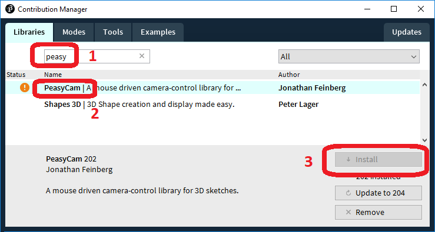
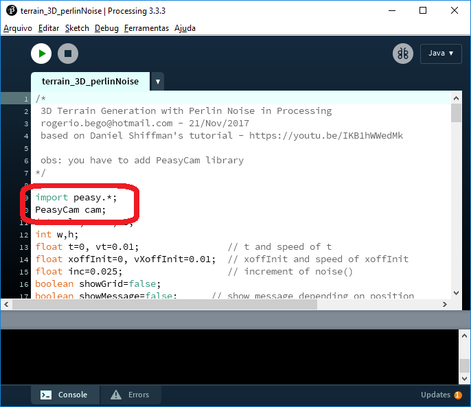
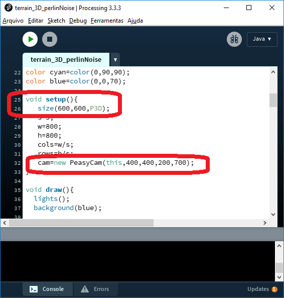

# Terrain Generator 3d PerlinNoise using Processing

 programmer: rogerio.bego@hotmail.com - 21/Nov/2017
 
 based on Daniel Shiffman's tutorial - https://youtu.be/IKB1hWWedMk
 
 See demonstration on youtube - https://youtu.be/mpnxzte8RT0

### 1 - download and install Processing IDE:  https://processing.org

### 2 - install PeasyCam library

 
 
 
